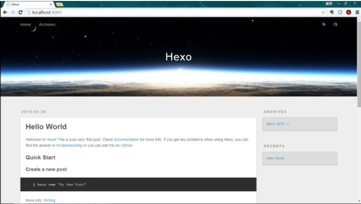

---
title: Hexo搭建个人博客
date: 2017-07-20 16:28:22
categories: "Hexo教程"
tags: [hexo]
description: Hexo搭建个人博客
---
	Hexo搭建个人博客，

## 搭建步骤
1.安装node.js环境
2.安装Git
3.安装Hexo
4.配置Github代码仓库及个人域名绑定
5.配置模板
6.Hexo常用命令
7.小结


### 安装node.js环境
1.下载node.js [下载地址](https://nodejs.org/en/)
2.安装教程 [教程](http://www.runoob.com/nodejs/nodejs-install-setup.html)

### 安装Git
1.下载Git [下载地址](https://git-scm.com/downloads)
2.安装教程 [教程](http://jingyan.baidu.com/article/90895e0fb3495f64ed6b0b50.html)

### 安装Hexo
1. 打开需要安装Hexo目录，鼠标右键选择 Git Bash Here 打开Git 命令行窗口 输入以下令

``` bash
	npm install hexo-cli -g  ## 局安装Hexo
    hexo init ## 始化Hexo
    hexo generate ## 生成静态页面
    hexo server ## 启动本地服务
  
```

#### 安装成功后  【测试地址】 localhost:4000


### 配置Github代码仓库及个人域名绑定

1. 登录 https://github.com/ 新建项目    命名规则必须是 XXX.github.io
2. 进入到新创建的项目 打开 Settings --> 找到 GitHub Pages 设置Source 下拉菜单为 master branch --> 点击保存;设置 Custom domain 为个人域名
3. 快捷键 win+r  ping XXX.github.io  把对应的IP地址 绑定至个人域名DNS
4. 在根目录 _config.yml 中追加如下代码


```
	deploy:
  	type: git
  	repo: https://github.com/qujingpeng/quzhigang.github.io.git
  	branch: master

```


### 配置模板

1. Hexo模板地址 https://hexo.io/themes/
2. 选择喜欢的模板，找到对应的git地址，下载至本地并解压至根目录下的 themes 目录
3. 修改 _config.yml 文件中, theme:模板解压后的目录名
4. 然后打开解压后的模板文件夹，复制_config.yml文件中的所有内容至根目录下的_config.yml最后

```
	##执行如下命令
    hexo clear
    hexo generate
    hexo server  

```


### Hexo常用命令

``` bash
	npm install hexo-cli -g ## 安装依赖
    hexo init ##初始化
    hexo generate ## 生成静态页面
    hexo server ## 启动本地服务
    hexo deploy## 部署hexo
    hexo clear ## 清空缓存文件
    hexo new "博客名称"
    hexo new page "页面"

```

### 小结

#### 博客内使用图片
	在 source下新建目录 imgs，然后放入图片，页面使用以下代码加载图片

```
	
```

#### 多设备更新博客
1.Git 创建两个分支 master 和 hexo 分支，master 维护要发布的代码，hexo维护开发代码，两台设置只维护同一个hexo分支，详情请看以下链接：
    [多设备更新博客](http://m.blog.csdn.net/csdn_lisword/article/details/73804982)


